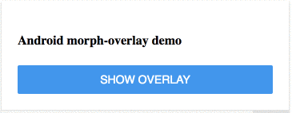

## &lt;morph-overlay&gt;
Overlay that morphs for current mobile OS

## Getting Started:
For the information about how to clone the desired repository, running the local server and testing, please refer to this [link](https://github.com/moduware/polymorph-components/blob/master/INFO.md).


## Demo
- Here is a quick demo of the morph-overlay element

```html

  <template>
      <h4>Android morph-overlay demo</h4>
      <morph-overlay id="androidOverlay" platform="android" onclick="closeAndroidOverlay()"></morph-overlay>
      <morph-button filled onclick="openAndroidOverlay()">Show Overlay</morph-button>
  </template>

```

<p align="center" >
  
</p>

## Attributes

|      Custom Attribute      |   Type  |                                   Description                                  |              Default              |
|:--------------------------:|:-------:|:------------------------------------------------------------------------------:|:---------------------------------:|
|       **`platform`**       |  String | Name of the platform, get assigned<br> automatically by the morph element.     | Either **`andorid`** or **`ios`** |
| **`open`** |  Boolean | Shows the state of the element,<br> if it is open or not.  | **`false`**                       |


## Styling
-For Android platform;

Custom property                  | Description                            | Default
---------------------------------|----------------------------------------|--------------------
`--android-background-color`     | Background color of overlay            | rgba(0,0,0,0.2)

-For IOS platform;

Custom property                  | Description                            | Default
---------------------------------|----------------------------------------|--------------------
`--ios-background-color`         | Background color of overlay            | rgba(0,0,0,0)
